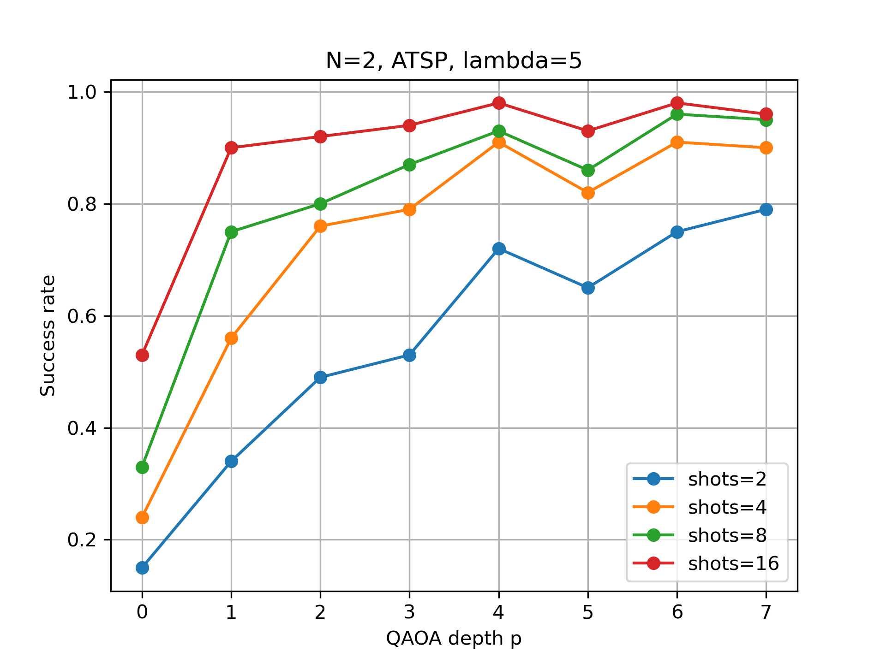
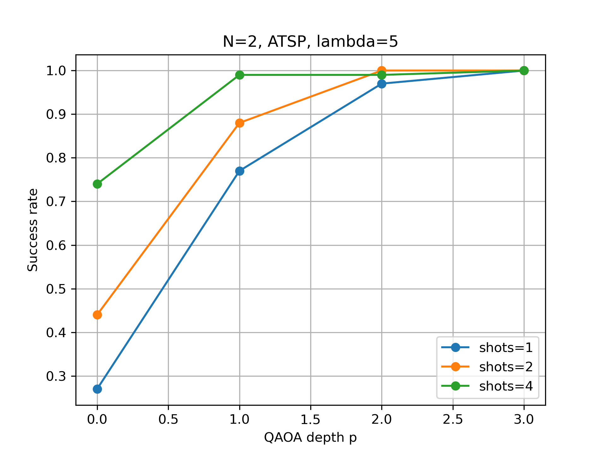
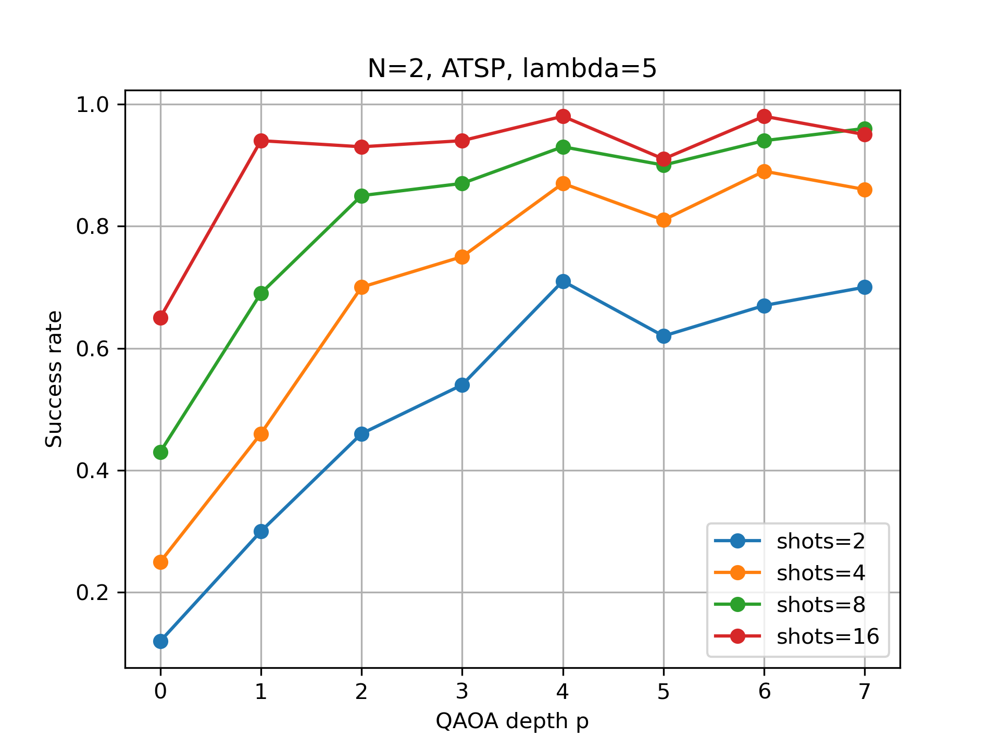
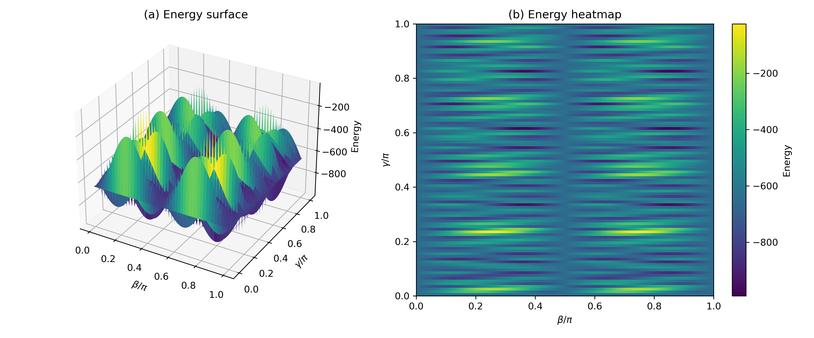

# QAOA for Traveling Salesman Problem (TSP)

This repository implements a full pipeline for solving the Traveling Salesman Problem (TSP) using the Quantum Approximate Optimization Algorithm (QAOA), including:

- TSP → QUBO → Ising mapping
- Exact classical solvers for benchmarking
- Statevector QAOA simulation
- Qiskit-based circuit implementation
- Tools to analyze success probability vs QAOA depth

---

## Features

- Generate random **asymmetric TSP (ATSP)** instances  
- Exact **brute-force solvers** for validation  
- Automatic **QUBO → Ising transformation**  
- Full **Hamiltonian construction**  
- **Statevector QAOA** (exact simulation)  
- **Qiskit-based QAOA circuits** (sampling + hardware-ready)  
- Evaluation of **success probability vs circuit depth**  
- Analysis of **noise effects and energy landscapes**

---

## Figures

### Example ATSP instance and optimal route

This figure shows a randomly generated asymmetric TSP instance with N=5, along with its optimal route (dark red) obtained from the classical exact solver.

---

### QAOA performance vs depth (ideal simulation)

#### Statevector / ideal QAOA

#### Constrained QAOA

#### Noisy QAOA (sampling-based)

These plots compare different QAOA variants:
- Ideal statevector simulation
- Constraint-preserving QAOA
- Noisy / sampling-based QAOA (hardware-relevant)

They demonstrate how noise and constraints impact performance as circuit depth increases.

---

### Energy landscape visualization

Visualization of the QAOA energy landscape as a function of variational parameters.  
This helps understand optimization difficulty, presence of local minima, and parameter concentration.

---
 

