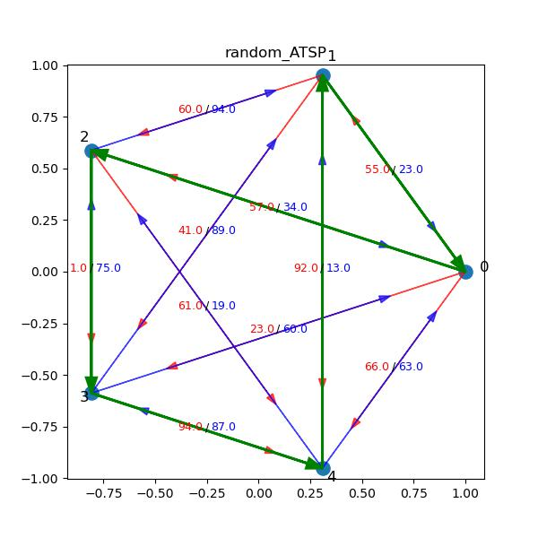
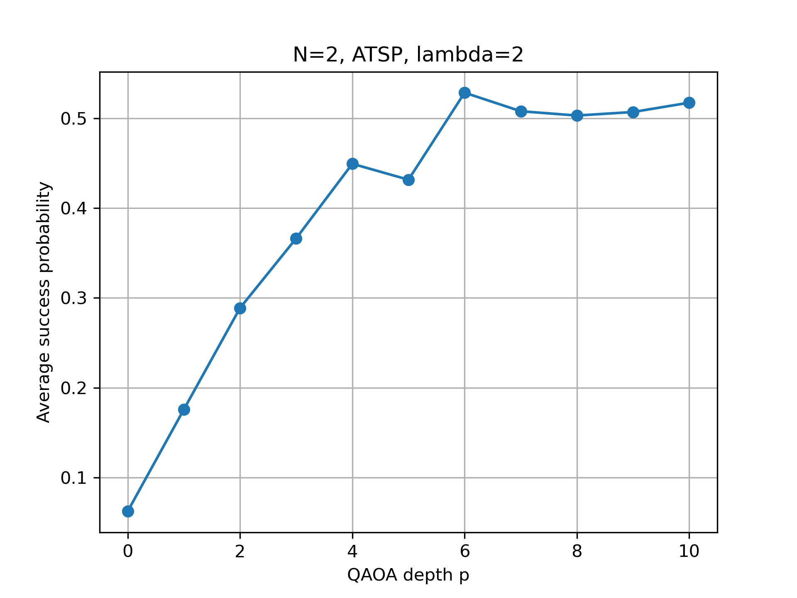

# QAOA for Traveling Salesman Problem (TSP)

This repository implements a full pipeline for solving the Traveling Salesman Problem (TSP) using the Quantum Approximate Optimization Algorithm (QAOA), including:

- TSP → QUBO → Ising mapping
- Exact classical solvers for benchmarking
- Statevector QAOA simulation
- Qiskit-based circuit implementation
- Tools to analyze success probability vs QAOA depth

---

## Features

-  Generate random **asymmetric TSP (ATSP)** instances  
-  Exact **brute-force solvers** for validation  
-  Automatic **QUBO → Ising transformation**  
-  Full **Hamiltonian construction**  
-  **Statevector QAOA** (exact simulation)  
-  **Qiskit-based QAOA circuits** (sampling + hardware-ready)  
-  Evaluation of **success probability vs circuit depth**

## Figures

### Example ATSP instance and optimal route

This figure shows a randomly generated asymmetric TSP instance with \(N=5\), along with its optimal route (green) obtained from the classical exact solver.

---

### QAOA performance vs depth

Average success probability of QAOA as a function of circuit depth \(p\), for \(N=2\) ATSP instances averaged over 100 random problems. The penalty parameter is set to \(\lambda = 2\).
